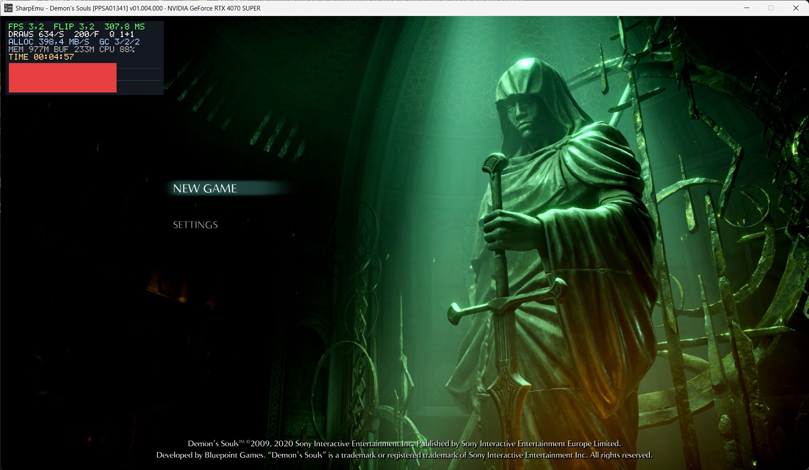
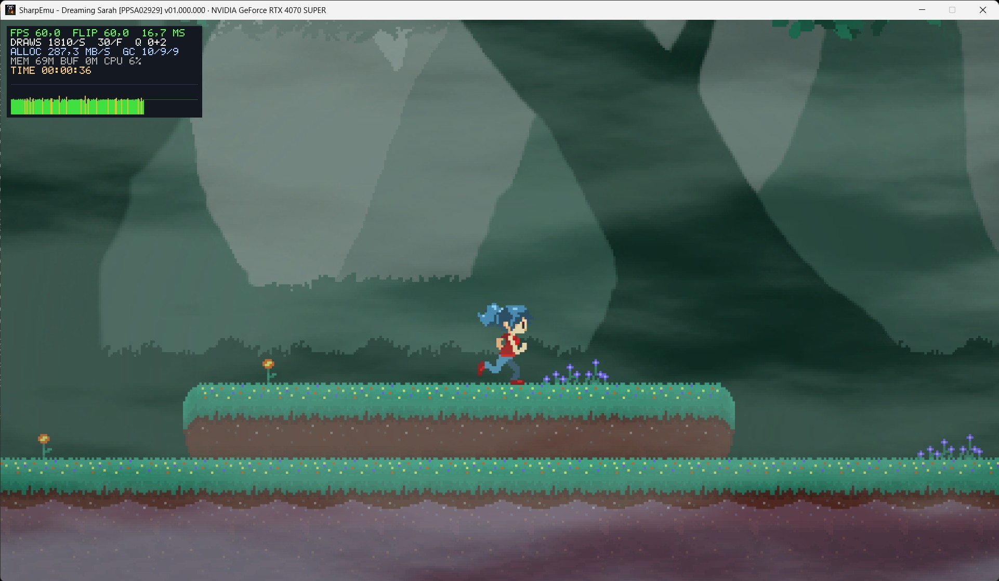
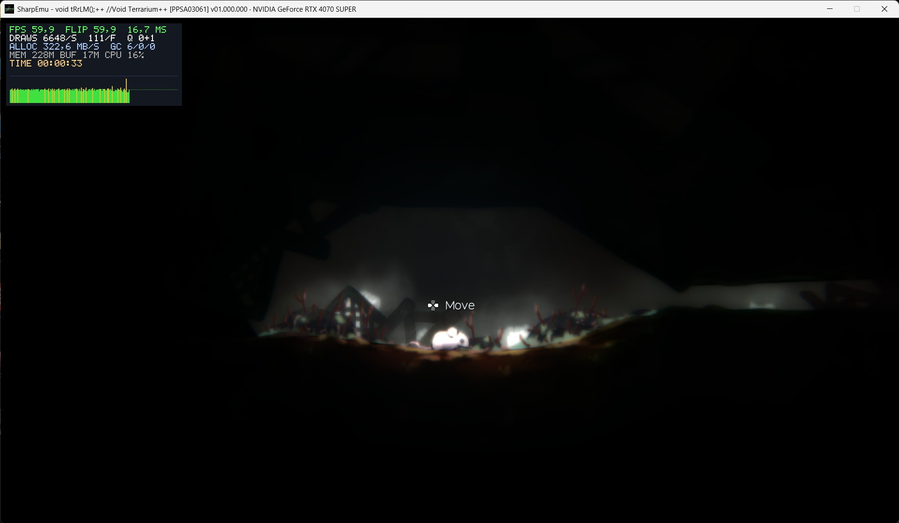
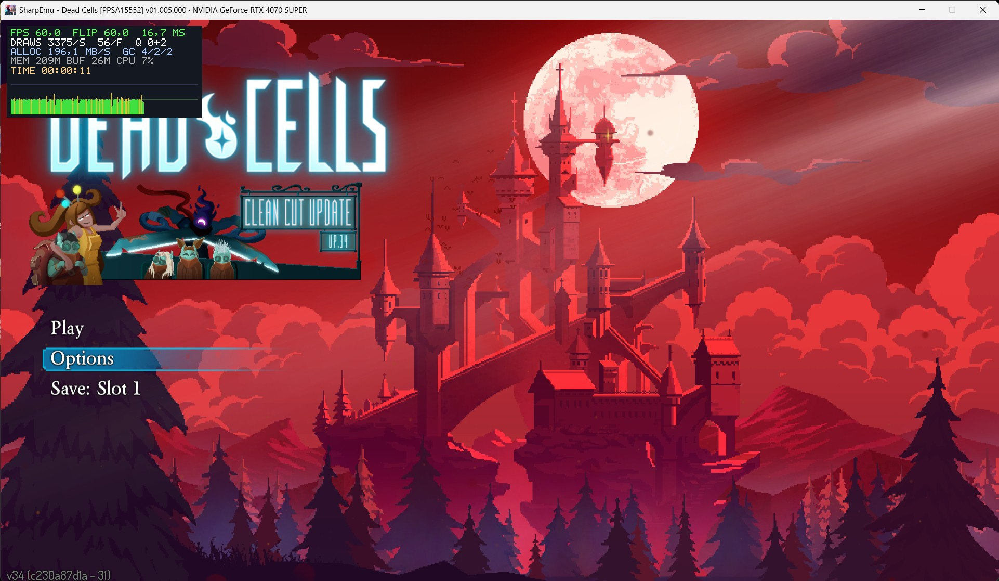

<!--
Copyright (C) 2026 ZylxEmu Emulator Project
SPDX-License-Identifier: GPL-2.0-or-later
-->

# ZylxEmu

<p align="center">
  
</p>

<p align="center">
  An experimental PlayStation 5 emulator for Windows, Linux and macOS.  
</p>

---

<p align="center">
  <a href="#support">
    
  </a>
</p>

---

> [!NOTE]  
> ZylxEmu supports Windows x64, Linux x64, and macOS x64. Apple Silicon Macs
> can run the macOS x64 build through Rosetta 2, and Windows on ARM devices
> (e.g. Snapdragon) can run the Windows x64 build through Windows' built-in
> x64 emulation.

> [!WARNING]  
> ZylxEmu is an experimental PS5 emulator developed from scratch in C#. The current focus is on accuracy and infrastructure setup rather than game-specific compatibility.

## Info

ZylxEmu is an emulator project currently in its early stages of development.

This project is developed purely for research and educational purposes. There are no commercial goals associated with it. We enjoy learning about system architecture and reverse engineering.

ZylxEmu focuses exclusively on the PlayStation 5.  
Our goal is **not** to emulate PS4 games, as there is already an excellent emulator dedicated to that platform: **ShadPS4**.

## Games Tested

|               Demons Souls Remake                   |                     Dreaming Sarah                         |
| :-----------------------------------------------------------: | :--------------------------------------------------------------------------------------------: |
|  |  |

|                  Void Terrarium                     |                 Dead Cells                    |
| :------------------------------------------------------------------------: | :------------------------------------------------------------------: |
|  |  |

## Status

The emulator can currently load the `eboot.bin` of real games, execute native CPU instructions, and partially handle kernel-related functionality. However, several critical components are still missing.

Current capabilities include:

* Loading `eboot.bin` and `.elf` files
* Executing native CPU instructions
* Reading basic game metadata (title, version, etc.)
* Loading system modules (`prx` / `sys_module`)
* Partial support for some kernel functions  
* `Fiber` and `AMPR` exports
* PlayGo scenarios
* Initial loading game files
* Shader/resource submits and AGC initial
* Video outputs in some games

Some games have reached like `sceVideoOut` and AGC stages.

ZylxEmu supports Windows, Linux, and macOS hosts. Video output uses Vulkan on
Windows and Linux, and MoltenVK on macOS. Platform support is still experimental,
so compatibility and performance vary by game, operating system, and GPU driver.

## Using

Download the release archive for your operating system, extract it, and launch
ZylxEmu with the path to a legally obtained game's `eboot.bin`.

Windows PowerShell:

```powershell
.\ZylxEmu.exe "C:\path\to\game\eboot.bin" 2>&1 |
  Tee-Object -FilePath "ZylxEmu.log"
```

Linux and macOS:

```bash
chmod +x ./ZylxEmu

./ZylxEmu "/path/to/game/eboot.bin" 2>&1 |
  tee ZylxEmu.log
```

A Vulkan-capable GPU and current graphics driver are required. The macOS
release includes the MoltenVK Vulkan implementation.

> [!IMPORTANT]  
> This project does **not** support or condone piracy.  
> All games used during development and testing are dumped from consoles that we personally own.  
> Users are expected to use legally obtained copies of their games.

## Build

1. Install the .NET SDK version specified in [`global.json`](./global.json).
2. Clone the repository: `git clone https://github.com/zylxemu/zylxemu.git`
3. Open the solution file (`ZylxEmu.slnx`) in **VSCode**.
4. Build the project: `dotnet build` or `dotnet publish`
5. Build artifacts will be located in the `artifacts` directory.

## Disclaimer

ZylxEmu is an experimental emulator intended for research and educational purposes.

This project does not contain any copyrighted system firmware, game data, or proprietary PlayStation assets.

## Special Thanks

The following projects were extremely helpful during development:

* **[ShadPS4](https://github.com/shadps4-emu/shadPS4)**  
Helped with understanding the basic architecture of the PlayStation 4.

* **[Kyty](https://github.com/InoriRus/Kyty)**  
One of the few PS5 emulator projects available and very useful for studying native code execution.

* **Ryujinx**  
Provided valuable references for filesystem handling and low-level C# implementation patterns.

# License

- [**GPL-2.0 license**](https://github.com/zylxemu/zylxemu/blob/main/LICENSE)

## Support

Support ZylxEmu via GitHub Sponsors or cryptocurrency. Every contribution helps fund ongoing development and long-term maintenance. GitHub Sponsors is the preferred way to support the project, but cryptocurrency donations are also appreciated.

### ETH/USDT

`0xF315F5d986c790bB3A58DbE60F1B2760997dEd82`

### BTC

`bc1qmr9k8899njys5ny63xsues4jgmkk96erslrkmv`

## Contributing

Before opening an issue or pull request, please read our contribution guidelines:

**[CONTRIBUTING.md](./CONTRIBUTING.md)**

The guide covers:
- Coding style and formatting
- AI-assisted contributions
- Pull request expectations
- Testing guidelines
- Legal and reverse engineering policy
